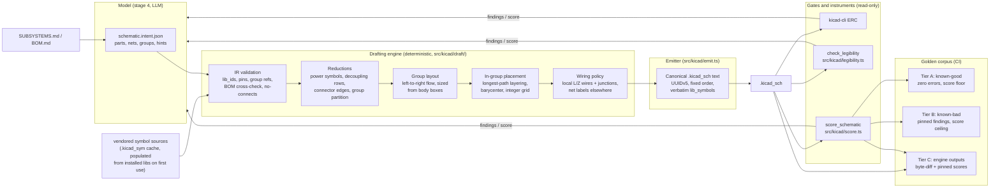

# deterministic-schematic-drafting: Design

## Context

Today the model authors `.kicad_sch` geometry as literal s-expression text through `edit_file`, one token at a time, and no gate examines how the drawing reads. This change consolidates what was previously split across two proposals: the legibility checker and drafting standard (formerly the `readable-schematic-drafting` change, PR #148) and the drafting engine that makes sheets satisfy that standard by construction. The checker follows the `symlib.ts` precedent: ERC checks the graph but not the drawing, so an unreadable sheet passes every gate while being unreviewable; the fix is a read-only checker module, an agent tool reporting divergences, and a completion condition. A checker alone, though, can only reject: the repair loop still routes through the model, re-emitting placement text on every nudge. Prior art says the obvious alternative is a trap: SKiDL's author spent about 21 months on force-directed placement plus full switchbox routing and still calls the output not pretty enough to use without cleanup, degrading past ~80 components. Everyone who ships something usable first shrinks the problem the way human drafters do: power and ground become per-pin symbols, non-local nets become labels, decoupling caps row up beside their IC, symbols cluster into subsystem blocks. After those reductions, a 30-100 symbol board is a set of per-group subgraphs of 3-15 symbols in mostly linear signal chains, which simple deterministic rules place near-optimally.

## Architecture

Entry points: the `draft_schematic` agent tool and the `copperhead draft schematic` command run IR through engine and emitter; `score_schematic` and `copperhead score schematic` run the scorer alone; `check --json` surfaces the score as advisory data. The repair loop, when a gate objects, edits the IR and re-drafts; it never edits geometry.

## Goals / Non-Goals

**Goals:**

- Same IR in, byte-identical `.kicad_sch` out, on any machine, every run.
- Sheets that pass the `schematic-legibility` gate by construction in the common case.
- Stage-4 output tokens dominated by the IR (connection list), not geometry.
- Quality measurable: a score that cannot regress silently, benchmarked against goldens.

**Non-Goals:**

- General-purpose place-and-route or crossing-minimal routing of arbitrary analog topologies; the wiring policy deliberately prefers labels over long wires.
- PCB layout drafting (#141).
- A template-corpus matcher (tscircuit-style); built-in idiom rules only, corpus as possible successor.
- Editing or reflowing human-drawn schematics; the engine only drafts sheets it authors from an IR.

## Decisions

### Engine and emitter

- **D1: Hand-rolled grid-native rules, no layout library.** elkjs is the only serious JS option and was rejected for v1: it is an 8MB GWT transpilation that cannot be debugged when a layout is wrong, it has no grid support so every coordinate would need snap-and-repair (a known bug farm; optimal grid snapping is NP-hard, and independent rounding of bend points breaks orthogonality and pin contact), and all schematic-convention logic (power reductions, decoupling rows, groups) has to be hand-written around it regardless. After reductions the per-group problem is 3-15 nodes, where longest-path layering plus barycenter ordering is a few hundred lines and near-optimal. Working in integer 1.27mm units from the start makes every pin on-grid by construction. elkjs (EPL-2.0, license-compatible as an unmodified dependency) stays the documented v2 escape hatch, judged by the Tier C harness.

- **D2: Label-heavy wiring policy, with room for local idioms.** Drawn wires are reserved for local nets: all endpoints inside one group, at most four endpoints, within a configured distance budget, routed orthogonally with synthesized junctions; idiom micro-templates (D10) may draw their internal multi-point wires. Everything else, and all inter-group connectivity, uses net labels, horizontal wherever horizontal fits. The four-endpoint allowance exists because a voltage divider tapped by an ADC pin or a crystal with its load caps is a 3+ endpoint net, and drawing those as floating label triplets reads machine-made, the exact failure this change exists to kill. Wiring happens only inside channels reserved between placement columns, so a drawn wire can never cross a symbol body and the engine cannot trip its own `wire-through-symbol` gate. This matches professional hand-drafting practice, matches the `schematic-legibility` standard's label-driven inter-block rule, and collapses the routing problem that consumed SKiDL's 21 months. Power-class nets are never routed: they are stripped from the graph before layout and re-emitted as per-pin power symbols, rails up, grounds down. Power-class recognition is itself deterministic and visible: a net is power-class when it touches a `power_in` or `power_out` pin or when the IR declares it, IR declaration wins, and the draft report lists every net's resolved class.

- **D3: The emitter is a string-template module; the parser still never serializes.** `src/kicad/emit.ts` builds canonical text from the placement model directly: fixed section order, KiCad number formatting (trailing zeros trimmed), fixed indentation. `lib_symbols` entries are copied verbatim from the `.kicad_sym` source text with only the lib_id rename, so no library geometry is ever re-serialized. The read-only sexp parser cross-checks emitter output in tests (parse what we emit, verify pin positions and net inference match the IR), which keeps the two implementations honest without coupling them.

- **D4: Determinism is structural: UUIDv5, canonical ordering, and vendored symbol sources.** Every UUID derives from a stable semantic path (project namespace, then `sheet/R1`, `sheet/R1/pin/2`, `wire/<net>/<index>`), symbols sort by reference, wires by coordinates, so identical IR yields byte-identical files and git diffs are meaningful. This is deliberately stronger than the closest prior art (tscircuit's schematic stages still call `crypto.randomUUID()`); byte-exact emission with golden-file tests is proven practice (kicad-sch-api). The guarantee is made honest across machines by hermetic symbol vendoring: on first use, a symbol's `.kicad_sym` source text is vendored into a committed project cache, and every draft reads the vendored copy, so a KiCad library upgrade cannot change drafted output or break the Tier C goldens until the vendored source is deliberately refreshed through a reviewable diff. `verify_symbols` keeps comparing against the installed libraries, so genuine library drift stays visible rather than silently frozen; this follows the repo's as-built-facts philosophy. Caveat documented: once a user re-saves in eeschema, KiCad rewrites formatting and UUIDs; byte-stability holds for files copperhead owns end-to-end.

- **D5: The IR is the model's only authoring surface for drafted sheets, including repairs.** `draft_schematic` accepts the full IR and re-drafts the whole sheet; when ERC, the checker, or the scorer objects, the model fixes the IR (wrong pin, missing group, bad direction hint) and re-drafts. The draft report embeds the checker findings and the score for the fresh sheet and updates the legibility ledger obligation directly, so a draft-check-score iteration costs one tool call instead of three, which is the #145 turn-cost concern applied to the loop's own mechanics. Geometry-level `edit_file` repair on an engine-drafted sheet is refused while the stage is in drafting mode, because a hand edit would be destroyed by the next re-draft and would make the golden pins meaningless. `copperhead do` on existing human-drawn schematics keeps the current `edit_file` path untouched.

- **D6: IR validation fails structured and early, including against BOM.md.** Unknown lib_ids, references to pins a symbol does not have, nets with fewer than two pins, symbols assigned to no group or a group absent from SUBSYSTEMS.md, no-connect declarations that contradict a net, and parts that mismatch BOM.md (missing refdes, differing value), all fail validation with a numbered finding list in the same shape as `verify_symbols` output, before any placement runs. The BOM cross-check exists because the model re-types part identity from BOM.md into the IR, and a transcription slip should die at validation, not survive to the drift gate after a full draft. The engine never writes a partial or best-effort file; a failed draft leaves the previous schematic untouched.

- **D6a: Every gate failure is resolvable through the IR.** Geometry edits are refused in drafting mode (D5), so the repair loop's only lever is the IR; anything ERC or the checker can flag must therefore map to an IR field or a deterministic engine rule, or the stage wedges the way the finish gate once did (#82). The two cases the dry run surfaced are specified explicitly: declared no-connects are emitted as `(no_connect …)` markers, and a power-class net with no `power_out` driver gets one synthesized `PWR_FLAG` at a deterministic location. Any future gate addition must state its IR lever as part of its spec.

- **D7: Scorer is graded, checker stays binary, and errors cap the score.** The checker (from `readable-schematic-drafting`) decides pass/fail on unambiguous defects. The scorer measures the judgment calls (crossings, bends, wire length, alignment, utilization, label ratio, group cohesion, flow violations) and reports a weighted 0-100 composite with the full pre-rounding per-metric breakdown. Any error-severity checker finding caps the composite below the Tier A floor, so a high score can never mask a gating defect. Weights and thresholds live in the existing `legibility` config block.

- **D8: Three-tier golden corpus with distinct jobs.** Tier A (known-good hand-drawn sheets: KiCad demo projects with compatible licenses, the repo fixture) pins zero error findings and a score floor, catching checker/scorer false positives. Tier B (the real #136 sheet plus one synthetic fixture per check family) pins exact finding lists and a score ceiling, proving each metric fires. Tier C (reference IRs drafted every CI run) pins byte-exact output and full score JSON, proving determinism and catching engine regressions. `--update-goldens` regenerates; the diff is the review artifact. Every tier renders to SVG as a CI artifact.

- **D9: The emitter targets one KiCad format version, pinned and tested.** The version stamp and token set match what the repo's scaffold and fixtures already use and what the installed `kicad-cli` verifies in CI. Version-specific tokens are confined to the emitter's header template, so a format bump is one reviewed change plus regenerated goldens, not a scatter of edits.

- **D10: Idioms are built-in rules, not a matched corpus.** Decoupling-cap rows, pull-up/pull-down stubs, crystal flanking, and connector edge placement are recognized structurally from the IR (net shape plus part class) and placed by fixed micro-templates. A learned or corpus-matched layout stage (tscircuit's PMARS direction) is a possible successor once Tier C data shows where the rules fall short.

- **D11: Beauty is constructed and measured, never gated.** A sheet that merely passes the gates can still look accidental: legal placements with ragged columns, uneven gaps, dog-leg wires between aligned pins, lopsided page balance. The absorbed change's non-goal ("no beauty metric") was right for a checker judging model output, because aesthetics as a pass/fail predicate invites threshold-thrash; it is wrong for an engine that owns placement, because symmetry and alignment are cheap deterministic properties when you are the one computing coordinates. So the engine runs a final alignment pass (shared column axes, uniform sibling gaps, collinear passive chains with zero-bend wires, mirror-symmetric pairs, centered group contents, balanced page), and the scorer quantifies the same properties as advisory metrics (axis-alignment ratio, spacing uniformity, straight-wire ratio, label alignment, whitespace balance, pair symmetry) so aesthetic regressions show up as a Tier C score delta. Nothing aesthetic ever gates, preserving C4's rationale; the checker stays a mechanical-predicate machine.

- **D12: Groups shelf-wrap into rows, in reading order.** Tiling groups left to right turns any design with more than a few subsystems into a ribbon: the reference-board light controller drafted at 750 x 83mm, a 9:1 strip that forces A1 and leaves 85% of the sheet empty. Groups therefore fill left to right and then top to bottom, exactly like text, so reading order survives the reflow and the scorer's flow-direction metric reads rows before columns (a minX-only ordering interleaves row 2 back into row 1 and invents flow violations for a drawing that reads perfectly). The wrap is expressed as per-group offsets against the single-row pass rather than as recomputed absolute positions, so a layout that already fits one row is bit-for-bit unchanged and no long-standing sheet shifts by a grid unit for free. It runs before the wire and label pass, because a shorter sheet turns label pairs back into drawn wires. Three sheet-level consequences of drafting real parts ride the same pass: stacked pins (a thermal pad carried as a second GND pin) are one point on the sheet and get one stub, one power symbol, and one value rather than an invisible duplicate stack; a power symbol's value text follows its stub outward instead of its net class, so a rail hanging off a downward pin does not throw its name back across the stub onto the part; and a stub-anchored label whose text box collides with a wire drafted later (nets draft in name order, so `COMP` cannot see the trunk `COMP_Z` is about to run through it) rides its own stub outward a grid unit at a time, up to four, which keeps the label attached and connectivity unchanged.

### Checker and gate

Carried over from the absorbed `readable-schematic-drafting` design; its original D1 (checker, not auto-placer) is superseded by this change, which builds both and keeps the checker as the independent gate the engine is judged against.

- **C1: Groups are plain rectangles and text, not KiCad `(group …)` items.** KiCad's native group construct is an editor selection aid: a uuid membership list that draws nothing on a plot. The goal is a visible captioned box in the SVG and PDF exports: a schematic `(rectangle …)` plus a `(text …)` caption. Membership is geometric containment, not a stored list, so a symbol outside its box is immediately detectable.

- **C2: Symbol body bounding boxes come from `lib_symbols` graphics only.** Union of the library entry's `rectangle`, `polyline`, `circle`, and `arc` items, transformed by the instance's position, rotation, and mirror, reusing the pin transform in `src/kicad/sexp.ts`. Pin name and number text are excluded: they sit inside large IC outlines by design, and including them would make every dense MCU symbol self-colliding.

- **C3: Text extents are approximated conservatively, and deliberately under-estimate.** KiCad's stroke font has no metrics table readable without KiCad internals. A text box is `chars × 0.6 × height` wide by `height` tall, the advance ratio tuned below the true average. Under-estimating means missed marginal collisions rather than invented ones: a false positive costs repair turns and can make the stage contract unsatisfiable; a false negative leaves one slightly tight label.

- **C4: The gating set is exactly the defects with a deterministic local fix.** `symbol-overlap`, `text-collision`, `off-grid`, `out-of-frame`, `ungrouped-symbol`, `unlabeled-group`, `group-overlap`, `wire-through-symbol`, and `empty-title-block` gate; `low-utilization`, `crowding`, `label-orientation`, and `cross-group-wire` are advisory because each rests on a threshold, and gating on a threshold invites the repair loop to thrash against a number.

- **C5: Findings are deduplicated by unordered pair and capped per family per sheet**, with the suppressed count stated, never a silent truncation, so a crowded cluster cannot emit a quadratic report.

- **C6: `check` reports, `create` gates.** The checker is deterministic and network-free, so it belongs in `check`'s output, but existing repos contain hand-drawn schematics that would light up under these checks; making `check` fail would break users on upgrade. `check` prints findings and leaves the exit code alone; the binding gate lives in the create pipeline, where copperhead authored the sheet. The same line scopes the `finish` obligation: it opens only on create-origin repos (the existing `origin` config marker the fab gate already uses), because on a hand-drawn repo an obligation the sheet cannot satisfy without a full redraw would wedge every schematic-touching `do` run. Hand-drawn repos still see every finding through the tool and `check`; per-family `off` in config (C7) remains the tuning knob on top.

- **C7: Thresholds and per-family severity live in one optional `legibility` config block** with documented defaults (grid pitch 1.27mm, minimum readable pitch 2.54mm edge to edge, utilization fraction 0.5, maximum wire length 50.8mm, per-family cap 10), a 0.01mm geometric tolerance, and `off` as the per-family escape hatch. Score weights (D7 above) share the same block.

- **C8: Page geometry comes from a standard-size table plus a reserved title-block rectangle.** An unrecognized `(paper …)` value makes page-relative checks report as skipped, never as passed, matching the loud-skip rule the SPICE gate established.

- **C9: Off-grid findings are reported first.** A repair nudge that leaves the grid silently breaks connectivity, so grid violations lead the report and ERC stays in the same loop.

## Risks / Trade-offs

- [False-positive collisions make the stage contract unsatisfiable and burn the turn budget] → conservative text extents (C3), body boxes excluding pin text (C2), a gating set limited to unambiguous defects (C4), per-family `off` in config (C7), the Tier A golden corpus as a standing false-positive net, and the existing repair-cycle cap and rollback as backstop.
- [Group boxes drawn as decoration around nothing satisfy the letter of the check] → membership is geometric, every non-power symbol must fall inside exactly one group, and captions must name a subsystem from SUBSYSTEMS.md or a component group from BOM.md, so an empty or invented box is itself a finding.
- [Rule-based placement produces a legal but awkward sheet on an unusual topology] → the scorer makes it visible instead of silent; Tier C pins it; the IR's optional hints (port direction, group order) give the model a sanctioned lever before anyone reaches for the elkjs escape hatch.
- [The IR cannot express something a real design needs (multi-unit symbols, buses, hierarchical sheets)] → IR schema is versioned from day one; validation rejects what it cannot express with a named limitation rather than mis-drafting; scope for v1 is flat single-sheet designs, which is what stage 4 produces today.
- [Refusing geometry edits in drafting mode strands the model when the engine has a genuine bug] → the stage's existing halt-with-resume-hint path applies; a halted run leaves the last good schematic and the failing IR side by side, which is exactly the bug report the Tier C corpus wants.
- [Byte-exact goldens are brittle against intentional emitter changes] → `--update-goldens` plus reviewed diffs is the designed workflow; goldens live in fixtures, not spec. Environmental brittleness (a KiCad library upgrade changing symbol sources under the goldens) is removed by the vendored symbol cache (D4): only a deliberate cache refresh can move Tier C bytes.
- [Tier A sheets from external projects raise licensing questions] → only permissively licensed or KiCad-shipped demo sheets are vendored, each with a provenance note.
- [Score weights are guesses at first] → weights are config with documented defaults, the breakdown is always printed, and Tier A/B pins bracket the composite from both sides, so a bad weight shows up as a golden diff, not a silent shift.

## Migration Plan

Additive, in two phases within one change. Phase one lands the checker against the current model-authored flow: geometry accessors, check families, `check_legibility` tool, ledger obligation, `check` advisories, and the legibility condition in the stage-4 contract, immediately stopping unreadable sheets. Phase two lands the engine: emitter and IR first (usable standalone as `copperhead draft schematic`), then the engine stages, scorer, and goldens, then the stage-4 restructure last, so `create` switches from model-authored geometry to engine drafting in a single reviewed step with the checker already in place to judge it. Rollback is config-free: reverting the stage-4 wiring restores the model-authored flow with the checker still gating; `draft`, `score`, and the corpus remain useful independently. External ordering: the `turn-budget-continue-and-loop-efficiency` change must archive first, since it owns the base text of the "Content-aware stage completion" requirement this change modifies.

## Open Questions

- Multi-unit symbols (e.g. quad op-amps) in the IR: model as one part with unit-qualified pins, or defer to a v2 IR version?
- Whether `copperhead draft` should accept a hand-written IR outside a copperhead project (useful for the corpus and for adoption, but widens the input surface).
- Paper-size selection: pick from content extent per the legibility standard, or let the IR pin it? Leaning content-derived with an IR override.
- Whether `label-orientation` can be tightened from advisory to gating once the "would horizontal fit" test is proven against real sheets (inherited from the absorbed change; the engine always prefers horizontal, so Tier C data will answer it).
